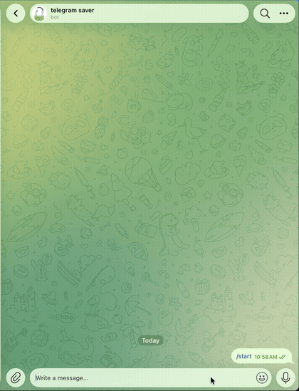

# telegram-restricted-downloader

Send a Telegram bot a `t.me/...` message link and get the message back, even from channels and groups that block saving and forwarding.

One Python file, ~130 lines, no database, no web server, no ffmpeg.



## Why another "save restricted content" bot

- 🧱 **Reads Telegram's new rich posts.** Since 2026 some channels publish block-based posts (the Instant View format). Their classic text and media fields are empty, so every other bot of this kind returns nothing. This one flattens the blocks and sends the text plus every photo and video in them.
- 🎬 **Keeps media as media.** Videos stay streamable with their dimensions and duration, voice notes stay voice notes, GIFs stay GIFs, captions and text formatting are preserved.
- 🔒 **Private by default.** Only the account ids you list can use it. Anyone else gets a polite refusal that shows them their own id.
- 🌍 **English and Persian replies.** Adding a language is copying one JSON file.
- 🪶 **Nothing to host but the script.** One file, no MongoDB, no Flask keep-alive, no Docker, no ffmpeg. Works on Windows, Linux and macOS.

## How it works

Two Telethon clients run in one process. Your own account (a user session) fetches the message and, if needed, downloads the media. The bot re-sends it to you. Bots cannot read arbitrary chats or copy out of protected ones, which is why the user session is required.

For private chats the fetching account must already be a member.

## Setup

1. Python 3.10 or newer, then `pip install -r requirements.txt`
2. Create an application at https://my.telegram.org to get `API_ID` and `API_HASH`. Create a bot with [@BotFather](https://t.me/BotFather) to get `BOT_TOKEN`.
3. `cp .env.example .env` and fill in the values.
4. `python bot.py`. The first run asks for the phone number and login code of the fetching account, plus the two-step password if enabled. The login is saved to `user.session`, so this happens once.
5. Open your bot in Telegram, press Start, paste a link.

## Supported links

```
https://t.me/channel/123           public channel or group
https://t.me/c/1234567890/123      private channel or group
https://t.me/c/1234567890/5/123    topic link
https://t.me/b/botname/123         a chat with a bot
https://t.me/channel/123?single    single item of an album
```

## Access control

`OWNER` in `.env` is a comma-separated list of Telegram account ids allowed to use the bot. Leave it empty to allow only the account you logged in with. Anyone not on the list who messages the bot is shown their own id, which is the easy way to collect ids from the people you want to add.

## Keep it running

Linux, quick and dirty:

```
nohup python bot.py >> bot.log 2>&1 &
```

Windows, as a task that starts at boot (asks for your password once):

```
schtasks /create /tn tgsave /sc onstart /ru %USERNAME% /rp * /tr "cmd /c cd /d C:\path\to\repo && python bot.py >> bot.log 2>&1"
```

## Update

```
git pull
```

then restart the process. Sessions and `.env` are untouched.

## Language

Replies are English by default. Set `BOT_LANG=fa` in `.env` for Persian. To add a language, copy `i18n/en.json` to `i18n/xx.json`, translate the values, and set `BOT_LANG=xx`. Pull requests with new languages are welcome.

## When something is not supported

If a post type the bot does not understand comes back, it replies with a dump of the raw message. Open an issue with that dump and the link type.

## Test

```
python test_bot.py
```

## Notes

Use your own API credentials and your own account. Respect the wishes of content owners and Telegram's terms. This tool exists for personal archiving of content you already have access to.

MIT license.
